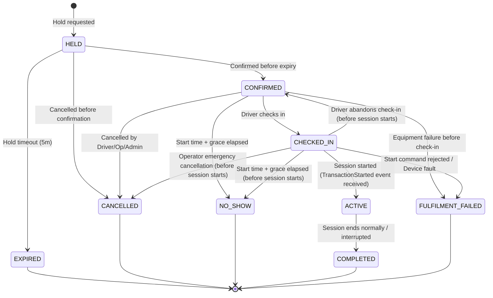

Document ID: DOM-002
Title: Lifecycle and Invariant Catalogue v1.0
Version: 1.0
Status: APPROVED
Owner: DA/BA
Last reviewed: 2026-07-12
Supersedes: None
Depends on: DOM-003, DOM-004, BKG-LC
Authoritative for: System State Transitions and Domain Invariants

# Lifecycle and Invariant Catalogue v1.0

This catalogue consolidates all state machines, permitted transitions, and business invariants across the EV Charging Booking Platform.

---

## 1. State Machines and Lifecycles

### 1.1 Booking Lifecycle

Permitted Transitions:
- `HELD` → `CONFIRMED` | `EXPIRED` | `CANCELLED`
- `CONFIRMED` → `CHECKED_IN` | `CANCELLED` | `NO_SHOW` | `FULFILMENT_FAILED`
- `CHECKED_IN` → `ACTIVE` | `FULFILMENT_FAILED` | `CONFIRMED` | `CANCELLED` | `NO_SHOW`
- `ACTIVE` → `COMPLETED` (Any failure during active session energy transfer results in COMPLETED with an interrupted outcome or INTERRUPTED session state, never FULFILMENT_FAILED).

*Booking vs. Session Lifecycle Correlation:*
- An interrupted **charging session** enters the `INTERRUPTED` state.
- The corresponding **booking** transitions to:
  - `COMPLETED` if energy transfer had already begun (actual charging occurred);
  - `FULFILMENT_FAILED` if the interruption occurred before any energy transfer took place (charging never started).

*Note:* Terminal states (`EXPIRED`, `CANCELLED`, `NO_SHOW`, `COMPLETED`, `FULFILMENT_FAILED`) cannot be reopened.

### 1.2 Charging Session Lifecycle
- `STARTING` — Remote start command submitted. (Can be flagged with `uncertain=true` during connection timeouts or ambiguous responses, remaining in `STARTING` until resolved.)
- `CHARGING` — Physical energy transfer in progress.
- `SUSPENDED` — Temporarily paused (e.g., vehicle request or grid load control).
- `STOPPING` — Stop requested, waiting for final meter values.
- `COMPLETED` — Session ended normally with full meter data.
- `INTERRUPTED` — Session ended due to device fault, grid loss, or emergency override.
- `START_REJECTED` — Central management system or charger rejected start.

Permitted Transitions:
- `STARTING` → `CHARGING` | `START_REJECTED` | `INTERRUPTED` (Timeout, lost connection, or ambiguous start result does not transition to `INTERRUPTED` or `START_REJECTED` immediately. The session remains in `STARTING` with `uncertain=true` until downstream reconciliation or a definitive charger telemetry event resolves the state.)
- `CHARGING` → `SUSPENDED` | `STOPPING` | `INTERRUPTED` | `COMPLETED`
- `SUSPENDED` → `CHARGING` | `STOPPING` | `INTERRUPTED` | `COMPLETED`
- `STOPPING` → `COMPLETED` | `INTERRUPTED` | `CHARGING` | `SUSPENDED`

*Reconciliation/Guard transitions:*
- `STOPPING` → `CHARGING` or `SUSPENDED` represents reconciliation where a stop command was sent but failed to reconcile or the charger rejects/fails to stop, keeping the session active.
- `STARTING` → `INTERRUPTED` is strictly guarded. It requires positive confirmation (via subsequent telemetry or meter sequence logs) that physical energy transfer actually began before the connection was lost. A mere start command acceptance followed by disconnection without energy transfer results in `START_REJECTED`.

### 1.3 Start Authorization Lifecycle
- `ISSUED` — Token generated upon successful check-in.
- `EXPIRED` — Check-in grace period ends without session starting.
- `CONSUMED` — Start attempt accepted for processing.
- `REVOKED` — Booking cancelled or check-in abandoned before start.

Permitted Transitions:
- `ISSUED` → `CONSUMED` | `EXPIRED` | `REVOKED`

*Note:* An authorization becomes `CONSUMED` as soon as the start command is accepted. Uncertain start outcomes prevent any second attempt. A retry requires a newly issued authorization bound to the same booking and a new attempt number.

### 1.4 Station Lifecycle
- `DRAFT` — Configuration in progress.
- `PUBLISHED` — Visible to drivers, accepting bookings.
- `TEMPORARILY_CLOSED` — Closed for events, holidays, or emergency maintenance.
- `DEACTIVATED` — Retired station. Kept for historical records.

Permitted Transitions:
- `DRAFT` → `PUBLISHED`
- `PUBLISHED` ↔ `TEMPORARILY_CLOSED`
- `PUBLISHED` → `DEACTIVATED`
- `TEMPORARILY_CLOSED` → `DEACTIVATED`
- `DEACTIVATED` → `DRAFT` (Permits reactivation, requiring full verification).

### 1.5 EVSE Administration Lifecycle
- `ACTIVE` — Equipment is administratively enabled.
- `DISABLED` — Temporarily disabled by operator override or maintenance.
- `DEACTIVATED` — Retired equipment (replaced or removed).

Permitted Transitions:
- `ACTIVE` ↔ `DISABLED`
- `ACTIVE` → `DEACTIVATED`
- `DISABLED` → `DEACTIVATED`

### 1.6 EVSE Operational Status Overrides Lifecycle
- `SCHEDULED` — Override created to start at a future date/time.
- `ACTIVE` — Override currently active, masking standard telemetry.
- `EXPIRED` — Override duration elapsed (automatic cleanup).
- `REVOKED` — Override manually cancelled or cleared.

Permitted Transitions:
- `[Creation]` → `SCHEDULED` (future start time)
- `[Creation]` → `ACTIVE` (immediate start time)
- `SCHEDULED` → `ACTIVE` | `REVOKED`
- `ACTIVE` → `EXPIRED` | `REVOKED`
- `EXPIRED` — Terminal record
- `REVOKED` — Terminal record

### 1.7 Machine Identity Lifecycle
- `PENDING_ENROLLMENT` — Provisioned in the registry but not yet active or validated.
- `ACTIVE` — Authenticated, verified, and emitting heartbeats.
- `SUSPENDED` — Temporarily blocked due to security or firmware mismatch.
- `REVOKED` — Permanently disabled, credentials invalidated.

Permitted Transitions:
- `PENDING_ENROLLMENT` → `ACTIVE`
- `ACTIVE` ↔ `SUSPENDED`
- `ACTIVE` → `REVOKED`
- `SUSPENDED` → `REVOKED`

### 1.8 Device Commands Lifecycle
- `CREATED` — Command prepared in database.
- `CANCELLED_BEFORE_DISPATCH` — Cancelled before dispatching to gateway.
- `SENT` — Dispatched over connection.
- `DELIVERED` — Acknowledged by Device Integration Service.
- `ACCEPTED` — Executed successfully by device.
- `REJECTED` — Charger rejected command execution.
- `TIMED_OUT` — No response received within the timeout window.
- `RECONCILING` — Non-terminal state after timeout, waiting for telemetry validation.

Permitted Transitions:
- `CREATED` → `SENT` | `CANCELLED_BEFORE_DISPATCH`
- `SENT` → `DELIVERED` | `TIMED_OUT`
- `DELIVERED` → `ACCEPTED` | `REJECTED` | `TIMED_OUT`
- `TIMED_OUT` → `RECONCILING`
- `RECONCILING` → `ACCEPTED` | `REJECTED`

### 1.9 Notification Delivery Lifecycle
- `REQUESTED` — Notification request created in the outbox.
- `QUEUED` — Notification rendered and queued in the delivery dispatcher.
- `DISPATCHING` — Submitted to the mail server/SMS gateway.
- `PROVIDER_ACCEPTED` — Downstream gateway accepted command for delivery.
- `DELIVERED` — Mailbox delivery confirmed by provider callback.

Side Outcomes:
- `TEMPORARILY_FAILED` — Transient network/socket error; scheduled for retry.
- `PERMANENTLY_FAILED` — Bounced or rejected by provider (e.g. bad address).
- `BOUNCED` — Provider bounced notice.
- `SUPPRESSED` — Recipient address on suppression list.
- `OBSOLETE` — Superseded by a newer notification before dispatch.
- `CANCELLED_BEFORE_SEND` — Cancelled manually or due to transaction rollback.

Permitted Transitions:
- `REQUESTED` → `QUEUED` | `CANCELLED_BEFORE_SEND`
- `QUEUED` → `DISPATCHING` | `OBSOLETE`
- `DISPATCHING` → `PROVIDER_ACCEPTED` | `TEMPORARILY_FAILED` | `PERMANENTLY_FAILED`
- `PROVIDER_ACCEPTED` → `DELIVERED` | `BOUNCED` | `SUPPRESSED`
- `TEMPORARILY_FAILED` → `DISPATCHING` (retry) | `PERMANENTLY_FAILED`

### 1.10 Support Cases Lifecycle
- `OPEN` — Ticket created.
- `IN_PROGRESS` — Assigned to support agent.
- `WAITING_FOR_USER` — Awaiting input from the driver.
- `WAITING_FOR_OPERATOR` — Awaiting input from the operator organization.
- `RESOLVED` — Action proposed/taken.
- `CLOSED` — User confirmed resolution or ticket closed automatically.

Permitted Transitions:
- `OPEN` → `IN_PROGRESS`
- `IN_PROGRESS` ↔ `WAITING_FOR_USER`
- `IN_PROGRESS` ↔ `WAITING_FOR_OPERATOR`
- `IN_PROGRESS` → `RESOLVED`
- `RESOLVED` → `CLOSED`
- `RESOLVED` → `IN_PROGRESS`

### 1.11 Privacy Deletion Workflow Lifecycle
- `SUBMITTED` — Request received.
- `VALIDATED` — Driver identity confirmed.
- `IN_PROGRESS` — Anonymization scripts running.
- `ANONYMIZED` — User data anonymized successfully.
- `REJECTED` — Request rejected (e.g., pending active booking).

Permitted Transitions:
- `SUBMITTED` → `VALIDATED` | `REJECTED`
- `VALIDATED` → `IN_PROGRESS`
- `IN_PROGRESS` → `ANONYMIZED` | `REJECTED`

### 1.12 Privacy Export Workflow Lifecycle
- `SUBMITTED` — Request received.
- `VALIDATED` — Driver identity confirmed.
- `PACKAGING` — Compiling user data.
- `DELIVERED` — Export package delivered to driver.
- `EXPIRED` — Download link expired.
- `REJECTED` — Request rejected.

Permitted Transitions:
- `SUBMITTED` → `VALIDATED` | `REJECTED`
- `VALIDATED` → `PACKAGING`
- `PACKAGING` → `DELIVERED` | `REJECTED`
- `DELIVERED` → `EXPIRED`

### 1.13 Invitations (Staff/Operator) Lifecycle
- `SENT` — Invitation link emailed.
- `ACCEPTED` — User clicked and linked account.
- `EXPIRED` — Validity window elapsed.
- `REVOKED` — Cancelled by operator manager.

Permitted Transitions:
- `SENT` → `ACCEPTED` | `EXPIRED` | `REVOKED`

### 1.14 Ownership Transfers Lifecycle
- `INITIATED` — Transfer request sent to target organization owner.
- `ACCEPTED` — Transfer completed.
- `EXPIRED` — Validity elapsed.
- `REJECTED` — Target owner declined.
- `CANCELLED` — Cancelled by initiator.

Permitted Transitions:
- `INITIATED` → `ACCEPTED` | `EXPIRED` | `REJECTED` | `CANCELLED`

### 1.15 Driver Fault Reports Lifecycle
- `SUBMITTED` — Driver reported EVSE fault.
- `REVIEWED` — Operator staff checked the report.
- `LINKED_TO_FAULT` — Linked to an active fault incident record.
- `ARCHIVED_DUPLICATE` — Logged as a duplicate of an existing known issue.

Permitted Transitions:
- `SUBMITTED` → `REVIEWED`
- `REVIEWED` → `LINKED_TO_FAULT` | `ARCHIVED_DUPLICATE`

### 1.16 Operator Application Lifecycle
- `DRAFT` — Application created but not yet submitted.
- `SUBMITTED` — Application submitted, awaiting review.
- `UNDER_REVIEW` — Administrator reviewing the application.
- `CLARIFICATION_REQUESTED` — Awaiting additional details from the applicant.
- `WITHDRAWN` — Application withdrawn by the applicant.
- `APPROVED` — Application approved. Atomically creates active operator organization and owner membership.
- `REJECTED` — Application rejected with structured reasons.

Permitted Transitions:
- `DRAFT` → `SUBMITTED` | `WITHDRAWN`
- `SUBMITTED` → `UNDER_REVIEW` | `WITHDRAWN`
- `UNDER_REVIEW` ↔ `CLARIFICATION_REQUESTED`
- `UNDER_REVIEW` → `APPROVED` | `REJECTED` | `WITHDRAWN`
- `CLARIFICATION_REQUESTED` → `WITHDRAWN`

### 1.17 Operator Organization Lifecycle
- `ACTIVE` — Approved organization actively managing stations.
- `SUSPENDED` — Suspended due to moderation or policy breach. Cannot manage stations or take bookings.
- `CLOSED` permanent retirement. All bookings resolved.

Permitted Transitions:
- `ACTIVE` ↔ `SUSPENDED`
- `ACTIVE` → `CLOSED`
- `SUSPENDED` → `CLOSED`

### 1.18 Driver Account Lifecycle
- `PENDING_VERIFICATION` → `ACTIVE` | `DELETED`
- `ACTIVE` → `SUSPENDED` | `DELETION_PENDING`
- `SUSPENDED` → `ACTIVE` | `DELETION_PENDING`
- `DELETION_PENDING` → `DELETED` | `ACTIVE` (cancellation during the 7-day cooling off period)

### 1.19 Maintenance Planning Record Lifecycle
- `DRAFT` — Plan created by operator (Owner: Operator Staff).
- `PROPOSED` — Plan submitted for review (Owner: Operator Staff. Event: `MaintenanceProposed`).
- `ENFORCEMENT_PENDING` — Request submitted to Booking authority to block capacity (Owner: Station Operations Service).
- `IMPACT_RESOLUTION` — Handling affected overlapping bookings via reassignment/alerts (Owner: Booking and Session Service).
- `SCHEDULED` — Capacity restriction enforced; task is officially scheduled (Owner: Booking and Session Service. Event: `MaintenanceScheduled`).
- `ACTIVE` — Task is in progress; EVSE operational status is marked as `MAINTENANCE` (Owner: Operator Staff/Device Integration Service. Event: `MaintenanceActivated`).
- `COMPLETED` — Task finished (normal, aborted, failed, or cancelled) (Owner: Operator Staff. Event: `MaintenanceCompleted`).

Permitted Transitions:
- `DRAFT` → `PROPOSED` (normal submission)
- `DRAFT` → `COMPLETED` (cancelled before submit; outcome = `CANCELLED`)
- `DRAFT` → `ACTIVE` (emergency activation; bypasses planning)
- `PROPOSED` → `ENFORCEMENT_PENDING`
- `PROPOSED` → `COMPLETED` (cancelled; outcome = `CANCELLED`)
- `ENFORCEMENT_PENDING` → `IMPACT_RESOLUTION` (enforcement accepted)
- `ENFORCEMENT_PENDING` → `COMPLETED` (enforcement rejected; outcome = `FAILED_ENFORCEMENT`)
- `IMPACT_RESOLUTION` → `SCHEDULED` (impacts resolved/reassigned)
- `IMPACT_RESOLUTION` → `COMPLETED` (aborted due to unresolved conflict; outcome = `ABORTED`)
- `SCHEDULED` → `ACTIVE` (maintenance work begins)
- `SCHEDULED` → `COMPLETED` (cancelled before start; outcome = `CANCELLED`)
- `ACTIVE` → `COMPLETED` (work finished; outcome = `SUCCESS` or `ABORTED`)

### 1.20 Fault Incident Lifecycle
- `OPEN` — Fault detected (via simulator telemetry or driver report).
- `ACKNOWLEDGED` — Operator staff acknowledged the issue.
- `IN_PROGRESS` — Maintenance/technician dispatched.
- `RESOLVED` — Equipment repaired. State returns to `UNKNOWN`.

Permitted Transitions:
- `OPEN` → `ACKNOWLEDGED`
- `ACKNOWLEDGED` ↔ `IN_PROGRESS`
- `IN_PROGRESS` → `RESOLVED`
- `RESOLVED` → `OPEN` (if issue reoccurs)

---

## 2. Core Domain Invariants

### 2.1 Double-Booking Prevention (Correctness Invariant)
- **Rule:** No two mutually exclusive new capacity claims may commit with overlapping effective intervals. An operational-occupation claim may overlap a pre-existing planned claim (`BOOKING_ALLOCATION`) during a physical overrun; the existing booking remains durable and enters operational-risk handling. No new conflicting claim may be accepted.
- **Allocation Interval Boundary Model:** 
  Capacity allocation is managed through three explicit claim types:
  - `BOOKING_HOLD`: A temporary, non-exclusive capacity block (5-minute TTL) assigned to a driver during checkout.
  - `BOOKING_ALLOCATION`: A confirmed planned capacity claim for a scheduled booking.
  - `OPERATIONAL_OCCUPATION`: An active operational claim tracking actual connection or charging. An operational-occupation claim may overlap a pre-existing planned allocation in an overrun scenario; the pre-existing allocation becomes `AT_RISK` (risk flag, not a lifecycle state) and undergoes same-station reassignment check.
- **Enforcement:** Enforced via pessimistic locking or database constraints at transaction boundaries in the Booking authority.

### 2.2 Resource Ownership & Scope Boundary
- **Rule:** Operator Staff may only view or modify resources (Stations, EVSEs, Bookings, Tariffs) owned by their specific `Operator Organization`.
- **Enforcement:** Enforced by validating organization membership and resource scope against Station Operations authority or a versioned, freshness-bounded membership projection. Token claims provide coarse role context only. Downstream services track a cached membership projection version stamp; membership changes trigger an asynchronous membership invalidation event, causing immediate local cache eviction and verification.

### 2.3 Privileged Access Security
- **Rule:** Multi-Factor Authentication (MFA) is strictly mandatory for all privileged roles (`OPERATOR_OWNER`, `OPERATOR_MANAGER`, `OPERATOR_TECHNICIAN`, `OPERATOR_SUPPORT`, `PLATFORM_SUPPORT`, `PLATFORM_ADMINISTRATOR`, `AUDITOR_SECURITY_REVIEWER`).
- **Enforcement:** Enforced via identity provider policy before issuing access tokens.

### 2.4 Tariff Snapshotted Integrity
- **Rule:** Once a booking changes from `HELD` to `CONFIRMED`, the tariff components must be snapshotted. Retrospective tariff changes by operators must not affect confirmed bookings.
- **Enforcement:** Stored as an immutable, serialized record linked directly to the Booking entity.

### 2.5 Data Minimization & Privacy
- **Rule:** Location history and detailed driver identities must be masked on support consoles unless actively assigned to an open support case. Personally identifiable information must be purged/anonymized within configured retention bounds after account deletion.

### 2.6 Session Overrun & Downstream Booking Conflicts
- **Rule:** When a vehicle does not unplug after its booking period ends, it creates a session overrun. The planned booking allocation concludes normally, and a separate operational-occupation claim continues tracking the physical connection.
- **Enforcement:** Already-existing future bookings on the same EVSE become `AT_RISK`. The Booking authority automatically attempts same-station reassignment to another compatible EVSE based on equivalence/driver-approval rules. The driver is notified. If reassignment is impossible, the operator and driver are immediately notified of the potential delay. The occupation claim is released only upon definitive disconnect or reconciliation evidence.

### 2.7 Restriction and Maintenance Handshake Lifecycles
- **Handshake Mechanics:** When maintenance is proposed (transitioning the planning record in Section 1.19 to `PROPOSED`), a capacity restriction in the Booking authority commits a `FREEZE` immediately before affected bookings are resolved. This prevents new booking creations during the impact resolution phase. Upon resolution, it transitions to `BLOCKED` (hard block), or is `RELEASED` if aborted. The planning record then transitions to `SCHEDULED`.
