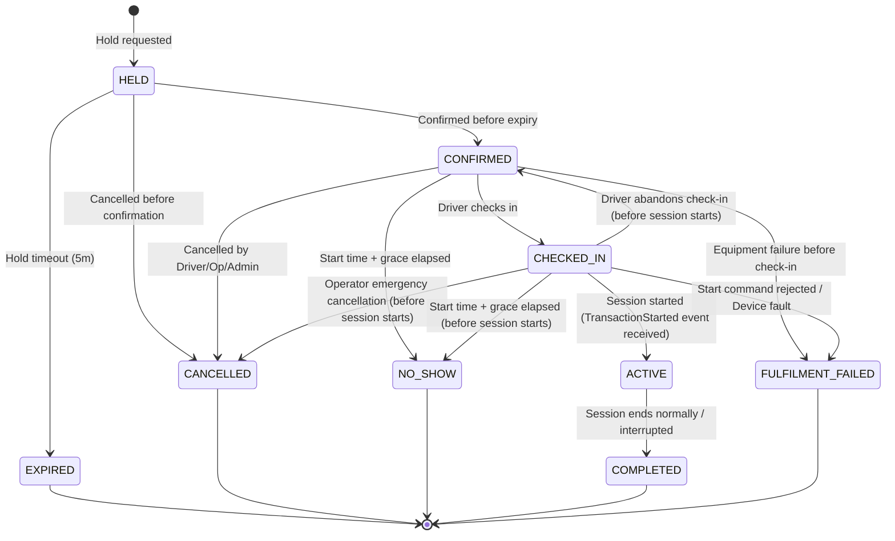

Document ID: DOM-002
Title: Lifecycle and Invariant Catalogue v1.0
Version: 1.0
Status: APPROVED
Owner: DA/BA
Last reviewed: 2026-07-11
Supersedes: None
Depends on: DOM-003, DOM-004, BKG-LC
Authoritative for: System State Transitions and Domain Invariants

# Lifecycle and Invariant Catalogue v1.0

This catalogue consolidates all state machines, permitted transitions, and business invariants across the EV Charging Booking Platform.

---

## 1. State Machines and Lifecycles

### 1.1 Booking Lifecycle

Permitted Transitions:
- `HELD` → `CONFIRMED` | `EXPIRED` | `CANCELLED`
- `CONFIRMED` → `CHECKED_IN` | `CANCELLED` | `NO_SHOW` | `FULFILMENT_FAILED`
- `CHECKED_IN` → `ACTIVE` | `FULFILMENT_FAILED` | `CONFIRMED` | `CANCELLED` | `NO_SHOW`
- `ACTIVE` → `COMPLETED` (Any failure during active session energy transfer results in COMPLETED with an interrupted outcome or INTERRUPTED session state, never FULFILMENT_FAILED).

*Booking vs. Session Lifecycle Correlation:*
- An interrupted **charging session** enters the `INTERRUPTED` state.
- The corresponding **booking** transitions to:
  - `COMPLETED` if energy transfer had already begun (actual charging occurred);
  - `FULFILMENT_FAILED` if the interruption occurred before any energy transfer took place (charging never started).

*Note:* Terminal states (`EXPIRED`, `CANCELLED`, `NO_SHOW`, `COMPLETED`, `FULFILMENT_FAILED`) cannot be reopened.

### 1.2 Charging Session Lifecycle
- `STARTING` — Remote start command submitted.
- `CHARGING` — Physical energy transfer in progress.
- `SUSPENDED` — Temporarily paused (e.g., vehicle request or grid load control).
- `STOPPING` — Stop requested, waiting for final meter values.
- `COMPLETED` — Session ended normally with full meter data.
- `INTERRUPTED` — Session ended due to device fault, grid loss, or emergency override.
- `START_REJECTED` — Central management system or charger rejected start.

Permitted Transitions:
- `STARTING` → `CHARGING` | `START_REJECTED` | `INTERRUPTED`
- `CHARGING` → `SUSPENDED` | `STOPPING` | `INTERRUPTED` | `COMPLETED`
- `SUSPENDED` → `CHARGING` | `STOPPING` | `INTERRUPTED` | `COMPLETED`
- `STOPPING` → `COMPLETED` | `INTERRUPTED` | `CHARGING` | `SUSPENDED`

*Reconciliation transitions:*
- `STOPPING` → `CHARGING` or `SUSPENDED` represents reconciliation where a stop command was sent but failed to reconcile or the charger rejects/fails to stop, keeping the session active.
- `STARTING` → `INTERRUPTED` represents cases where the remote start was accepted, but a physical fault or disconnection interrupted the startup before `TransactionStarted` could be received.

### 1.3 Start Authorization Lifecycle
- `CREATED` — Start authorization token generated upon check-in.
- `EXPIRED` — Check-in grace period ends without session starting.
- `CONSUMED` — Session successfully started with this token.
- `REVOKED` — Booking cancelled or check-in abandoned before start.

Permitted Transitions:
- `CREATED` → `CONSUMED` | `EXPIRED` | `REVOKED`

### 1.4 Station Lifecycle
- `DRAFT` — Configuration in progress.
- `PUBLISHED` — Visible to drivers, accepting bookings.
- `TEMPORARILY_CLOSED` — Closed for events, holidays, or emergency maintenance.
- `DEACTIVATED` — Retired station. Kept for historical records.

Permitted Transitions:
- `DRAFT` → `PUBLISHED`
- `PUBLISHED` ↔ `TEMPORARILY_CLOSED`
- `PUBLISHED` → `DEACTIVATED`
- `TEMPORARILY_CLOSED` → `DEACTIVATED`

### 1.5 EVSE Administration Lifecycle
- `ACTIVE` — Equipment is administratively enabled.
- `DISABLED` — Temporarily disabled by operator override or maintenance.
- `DEACTIVATED` — Retired equipment (replaced or removed).

Permitted Transitions:
- `ACTIVE` ↔ `DISABLED`
- `ACTIVE` → `DEACTIVATED`
- `DISABLED` → `DEACTIVATED`

### 1.6 EVSE Operational Status Overrides Lifecycle
- `NONE` — Standard status determined by telemetry.
- `ACTIVE_OVERRIDE` — Status manually forced by operator.
- `EXPIRED` — Override duration elapsed (automatic expiry).
- `REMOVED` — Override manually cleared.

Permitted Transitions:
- `NONE` → `ACTIVE_OVERRIDE`
- `ACTIVE_OVERRIDE` → `EXPIRED` | `REMOVED`
- `EXPIRED` | `REMOVED` → `NONE`

### 1.7 Machine Identity Lifecycle
- `PROVISIONED` — Credentials created in central system.
- `REGISTERED` — First charger boot and verification (handshake).
- `ACTIVE` — Online, emitting heartbeats.
- `SUSPENDED` — Temporarily blocked due to security or firmware mismatch.
- `DECOMMISSIONED` — Permanently retired charger hardware.

Permitted Transitions:
- `PROVISIONED` → `REGISTERED`
- `REGISTERED` → `ACTIVE`
- `ACTIVE` ↔ `SUSPENDED`
- `ACTIVE` → `DECOMMISSIONED`
- `SUSPENDED` → `DECOMMISSIONED`

### 1.8 Device Commands Lifecycle
- `PENDING` — Command queued.
- `SENT` — Dispatched over connection.
- `DELIVERED` — Acknowledged by device gateway.
- `ACCEPTED` — Command successfully executed by charger.
- `REJECTED` — Charger rejected command execution.
- `TIMED_OUT` — No response received within the timeout window.

Permitted Transitions:
- `PENDING` → `SENT`
- `SENT` → `DELIVERED` | `TIMED_OUT`
- `DELIVERED` → `ACCEPTED` | `REJECTED` | `TIMED_OUT`

### 1.9 Notification Delivery Lifecycle
- `QUEUED` — Notification generated.
- `SENT` — Handed over to provider.
- `DELIVERED` — Delivery confirmed by receipt payload (where supported).
- `FAILED` — Delivery failed after maximum retries.

Permitted Transitions:
- `QUEUED` → `SENT`
- `SENT` → `DELIVERED` | `FAILED`

### 1.10 Support Cases Lifecycle
- `OPEN` — Ticket created.
- `IN_PROGRESS` — Assigned to support agent.
- `WAITING_FOR_USER` — Awaiting input from the driver.
- `WAITING_FOR_OPERATOR` — Awaiting input from the operator organization.
- `RESOLVED` — Action proposed/taken.
- `CLOSED` — User confirmed resolution or ticket closed automatically.

Permitted Transitions:
- `OPEN` → `IN_PROGRESS`
- `IN_PROGRESS` ↔ `WAITING_FOR_USER`
- `IN_PROGRESS` ↔ `WAITING_FOR_OPERATOR`
- `IN_PROGRESS` → `RESOLVED`
- `RESOLVED` → `CLOSED`
- `RESOLVED` → `IN_PROGRESS` (if user rejects resolution)

### 1.11 Privacy Requests (Export/Deletion) Lifecycle
- `SUBMITTED` — Request received.
- `VALIDATED` — Driver identity confirmed.
- `IN_PROGRESS` — Anonymization/export scripts running.
- `COMPLETED` — Data package delivered or user data anonymized.
- `REJECTED` — Request rejected (e.g. active booking or session pending).

Permitted Transitions:
- `SUBMITTED` → `VALIDATED` | `REJECTED`
- `VALIDATED` → `IN_PROGRESS`
- `IN_PROGRESS` → `COMPLETED` | `REJECTED`

### 1.12 Invitations (Staff/Operator) Lifecycle
- `SENT` — Invitation link emailed.
- `ACCEPTED` — User clicked and linked account.
- `EXPIRED` — Validity window (e.g., 48 hours) elapsed.
- `REVOKED` — Cancelled by operator manager.

Permitted Transitions:
- `SENT` → `ACCEPTED` | `EXPIRED` | `REVOKED`

### 1.13 Ownership Transfers Lifecycle
- `INITIATED` — Transfer request sent to target organization owner.
- `ACCEPTED` — Transfer completed.
- `EXPIRED` — Validity elapsed.
- `REJECTED` — Target owner declined.
- `CANCELLED` — Cancelled by initiator.

Permitted Transitions:
- `INITIATED` → `ACCEPTED` | `EXPIRED` | `REJECTED` | `CANCELLED`

### 1.14 Driver Fault Reports Lifecycle
- `SUBMITTED` — Driver reported EVSE fault.
- `REVIEWED` — Operator staff checked the report.
- `LINKED_TO_FAULT` — Linked to an active fault incident record.
- `ARCHIVED_DUPLICATE` — Logged as a duplicate of an existing known issue.

Permitted Transitions:
- `SUBMITTED` → `REVIEWED`
- `REVIEWED` → `LINKED_TO_FAULT` | `ARCHIVED_DUPLICATE`

### 1.15 Operator Application Lifecycle
- `SUBMITTED` — Operator organization request submitted.
- `UNDER_REVIEW` — Administrator reviewing the application.
- `CLARIFICATION_REQUESTED` — Awaiting additional details from the applicant.
- `APPROVED` — Application approved. Creates active operator organization.
- `REJECTED` — Application rejected with structured reasons.

Permitted Transitions:
- `SUBMITTED` → `UNDER_REVIEW`
- `UNDER_REVIEW` ↔ `CLARIFICATION_REQUESTED`
- `UNDER_REVIEW` → `APPROVED` | `REJECTED`

### 1.16 Operator Organization Lifecycle
- `ACTIVE` — Approved organization actively managing stations.
- `SUSPENDED` — Suspended due to moderation or policy breach. Cannot manage stations or take bookings.
- `CLOSED` — Permanently closed. All bookings must be resolved first.

Permitted Transitions:
- `ACTIVE` ↔ `SUSPENDED`
- `ACTIVE` → `CLOSED`
- `SUSPENDED` → `CLOSED`

### 1.17 Driver Account Lifecycle
- `PENDING_VERIFICATION` → `ACTIVE` | `DELETED`
- `ACTIVE` → `SUSPENDED` | `DELETION_PENDING`
- `SUSPENDED` → `ACTIVE` | `DELETION_PENDING`
- `DELETION_PENDING` → `DELETED`

---

## 2. Core Domain Invariants

### 2.1 Double-Booking Prevention (Correctness Invariant)
- **Rule:** No two Allocations may overlap on the same `EVSE` during any time interval.
- **Allocation Interval Boundary Model:** 
  An Allocation represents an effective time block on the physical hardware $[T_{start}, T_{end\_effective})$ where:
  - For planned bookings, $T_{start}$ is the scheduled start and $T_{end\_effective} = T_{end} + B_{turn}$ (scheduled end plus turnaround buffer).
  - For checked-in or active bookings, $T_{end\_effective}$ extends to the actual session completion time plus turnaround buffer, or the grace deadline if a no-show occurs.
  - For uncertain physical occupation (e.g. telemetry indicates active energy transfer but connection is stale/unknown), the Allocation remains active until reconciliation resolves the state.
  - A new allocation request is valid if and only if it does not overlap with any existing non-released Allocation.
- **Enforcement:** Enforced via pessimistic locking or database constraints at transaction boundaries in the Booking authority.

### 2.2 Resource Ownership & Scope Boundary
- **Rule:** Operator Staff may only view or modify resources (Stations, EVSEs, Bookings, Tariffs) owned by their specific `Operator Organization`.
- **Enforcement:** Enforced at the service layer by verifying `OrganizationID` claims on every request.

### 2.3 Privileged Access Security
- **Rule:** Multi-Factor Authentication (MFA) is strictly mandatory for all privileged roles (`OPERATOR_OWNER`, `OPERATOR_MANAGER`, `OPERATOR_TECHNICIAN`, `OPERATOR_SUPPORT`, `PLATFORM_SUPPORT`, `PLATFORM_ADMINISTRATOR`, `AUDITOR_SECURITY_REVIEWER`).
- **Enforcement:** Enforced via identity provider policy before issuing access tokens.

### 2.4 Tariff Snapshotted Integrity
- **Rule:** Once a booking changes from `HELD` to `CONFIRMED`, the tariff components must be snapshotted. Retrospective tariff changes by operators must not affect confirmed bookings.
- **Enforcement:** Stored as an immutable, serialized record linked directly to the Booking entity.

### 2.5 Data Minimization & Privacy
- **Rule:** Location history and detailed driver identities must be masked on support consoles unless actively assigned to an open support case. Personally identifiable information must be purged/anonymized within configured retention bounds after account deletion.
