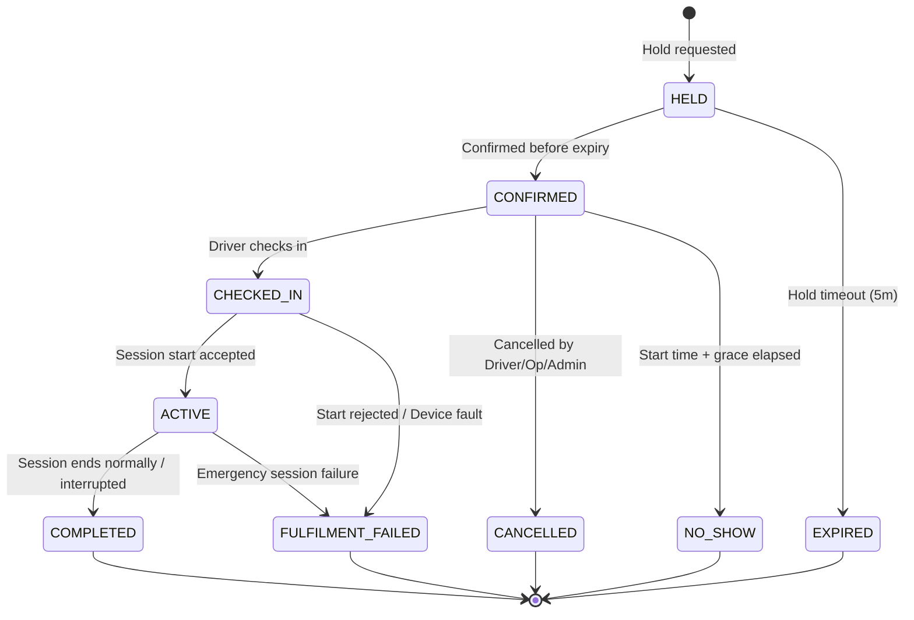

Document ID: DOM-002
Title: Lifecycle and Invariant Catalogue v1.0
Version: 1.0
Status: APPROVED
Owner: DA/BA
Last reviewed: 2026-07-11
Supersedes: None
Depends on: DOM-003, DOM-004, BKG-LC
Authoritative for: System State Transitions and Domain Invariants

# Lifecycle and Invariant Catalogue v1.0

This catalogue consolidates all state machines, permitted transitions, and business invariants across the EV Charging reservation system.

---

## 1. State Machines and Lifecycles

### 1.1 Booking Lifecycle

Permitted Transitions:
- `HELD` → `CONFIRMED` | `EXPIRED`
- `CONFIRMED` → `CHECKED_IN` | `CANCELLED` | `NO_SHOW`
- `CHECKED_IN` → `ACTIVE` | `FULFILMENT_FAILED`
- `ACTIVE` → `COMPLETED` | `FULFILMENT_FAILED`

*Note:* Terminal states (`EXPIRED`, `CANCELLED`, `NO_SHOW`, `COMPLETED`, `FULFILMENT_FAILED`) cannot be reopened.

### 1.2 Charging Session Lifecycle
- `STARTING` — Remote start command submitted.
- `CHARGING` — Physical energy transfer in progress.
- `SUSPENDED` — Temporarily paused (e.g., vehicle request or grid load control).
- `STOPPING` — Stop requested, waiting for final meter values.
- `COMPLETED` — Session ended normally with full meter data.
- `INTERRUPTED` — Session ended due to device fault, grid loss, or emergency override.
- `START_REJECTED` — Central management system or charger rejected start.

Permitted Transitions:
- `STARTING` → `CHARGING` | `START_REJECTED`
- `CHARGING` → `SUSPENDED` | `STOPPING` | `INTERRUPTED`
- `SUSPENDED` → `CHARGING` | `STOPPING` | `INTERRUPTED`
- `STOPPING` → `COMPLETED` | `INTERRUPTED`

### 1.3 Maintenance Record Lifecycle
- `SCHEDULED` — Planned maintenance interval created.
- `ACTIVE` — Maintenance work currently ongoing. Affected EVSEs are offline.
- `COMPLETED` — Maintenance finished. Returns EVSE state to `UNKNOWN`.
  - *Optionally* with `completionOutcome = ABORTED`.
- `CANCELLED` — Scheduled maintenance cancelled before starting.

### 1.4 Fault Record Lifecycle
- `OPEN` — Fault detected (via simulator telemetry or driver report).
- `ACKNOWLEDGED` — Operator staff acknowledged the issue.
- `IN_PROGRESS` — Maintenance/technician dispatched.
- `RESOLVED` — Equipment repaired. State returns to `UNKNOWN` until next heartbeat.

### 1.5 Operator Organization Lifecycle
- `PENDING_APPROVAL` → `ACTIVE` | `CLOSED`
- `ACTIVE` → `SUSPENDED` | `CLOSED`
- `SUSPENDED` → `ACTIVE` | `CLOSED`

### 1.6 Driver Account Lifecycle
- `PENDING_VERIFICATION` → `ACTIVE` | `DELETED`
- `ACTIVE` → `SUSPENDED` | `DELETION_PENDING`
- `SUSPENDED` → `ACTIVE` | `DELETION_PENDING`
- `DELETION_PENDING` → `DELETED`

---

## 2. Core Domain Invariants

### 2.1 Double-Booking Prevention (Correctness Invariant)
- **Rule:** No two bookings may overlap for the same `EVSE` during any time interval.
- **Formula:** A booking for interval $[T_{start}, T_{end}]$ on EVSE $E$ is valid if and only if no other booking on $E$ has a state of `HELD`, `CONFIRMED`, `CHECKED_IN`, or `ACTIVE` in interval $[T_{start} - B_{turn}, T_{end} + B_{turn}]$, where $B_{turn}$ is the configured station turnaround buffer (e.g., 15 minutes).
- **Enforcement:** Enforced via pessimistic locking or database constraints at transaction boundaries in the Booking Service.

### 2.2 Resource Ownership & Scope Boundary
- **Rule:** Operator Staff may only view or modify resources (Stations, EVSEs, Bookings, Tariffs) owned by their specific `Operator Organization`.
- **Enforcement:** Enforced at the service layer by verifying `OrganizationID` claims on every request.

### 2.3 Privileged Access Security
- **Rule:** Multi-Factor Authentication (MFA) is strictly mandatory for all privileged roles (`Operator Owner`, `Operator Manager`, `Technician`, `Support Agent`, `Platform Administrator`, `Auditor`).
- **Enforcement:** Enforced via identity provider policy before issuing access tokens.

### 2.4 Tariff Snapshotted Integrity
- **Rule:** Once a booking changes from `HELD` to `CONFIRMED`, the tariff components must be snapshotted. Retrospective tariff changes by operators must not affect confirmed bookings.
- **Enforcement:** Stored as an immutable, serialized record linked directly to the Booking entity.

### 2.5 Data Minimization & Privacy
- **Rule:** Location history and detailed driver identities must be masked on support consoles unless actively assigned to an open support case. Personally identifiable information must be purged/anonymized within configured retention bounds after account deletion.
