Document ID: DOM-002
Title: Lifecycle and Invariant Catalogue v1.0
Version: 1.0
Status: APPROVED
Owner: DA/BA
Last reviewed: 2026-07-12
Supersedes: None
Depends on: DOM-003, DOM-004, BKG-LC
Authoritative for: System State Transitions and Domain Invariants

# Lifecycle and Invariant Catalogue v1.0

This catalogue consolidates all state machines, permitted transitions, and business invariants across the EV Charging Booking Platform.

---

## 1. State Machines and Lifecycles

### 1.1 Booking Lifecycle

```mermaid
stateDiagram-v2
    [*] --> HELD : Hold requested
    HELD --> CONFIRMED : Confirmed before expiry
    HELD --> EXPIRED : Hold timeout (5m)
    HELD --> CANCELLED : Cancelled before confirmation
    CONFIRMED --> CHECKED_IN : Driver checks in
    CONFIRMED --> CANCELLED : Cancelled by Driver/Op/Admin
    CONFIRMED --> NO_SHOW : Start time + grace elapsed
    CONFIRMED --> FULFILMENT_FAILED : Equipment failure before check-in
    CHECKED_IN --> ACTIVE : Session started (TransactionStarted event received)
    CHECKED_IN --> CONFIRMED : Driver temporarily withdraws (window remains valid; authorization revoked)
    CHECKED_IN --> CANCELLED : Operator emergency cancellation (before session starts)
    CHECKED_IN --> DRIVER_ABANDONED : Driver permanently abandons (terminal)
    CHECKED_IN --> FULFILMENT_FAILED : Retry/reassignment exhausted
    ACTIVE --> COMPLETED : Session ends normally / interrupted
    EXPIRED --> [*]
    CANCELLED --> [*]
    NO_SHOW --> [*]
    DRIVER_ABANDONED --> [*]
    COMPLETED --> [*]
    FULFILMENT_FAILED --> [*]
```

State Definitions:
- `DRIVER_ABANDONED` — Terminal. Driver checked in but decided not to charge (e.g., left location, incompatible connector, vehicle issue). Cannot be reopened. Distinct from `CONFIRMED` (temporary withdrawal while window remains open).

Permitted Transitions:
- `HELD` → `CONFIRMED` | `EXPIRED` | `CANCELLED`
- `CONFIRMED` → `CHECKED_IN` | `CANCELLED` | `NO_SHOW` | `FULFILMENT_FAILED`
- `CHECKED_IN` → `ACTIVE` | `CONFIRMED` | `CANCELLED` | `DRIVER_ABANDONED` | `FULFILMENT_FAILED`
- `ACTIVE` → `COMPLETED` (Any failure during active session energy transfer results in COMPLETED with an interrupted outcome or INTERRUPTED session state, never FULFILMENT_FAILED).

*Booking vs. Session Lifecycle Correlation:*
- An interrupted **charging session** enters the `INTERRUPTED` state.
- The corresponding **booking** transitions to:
  - `COMPLETED` if energy transfer had already begun (actual charging occurred);
  - `FULFILMENT_FAILED` if the interruption occurred before any energy transfer took place (charging never started).

*Note:* Terminal states (`EXPIRED`, `CANCELLED`, `NO_SHOW`, `COMPLETED`, `FULFILMENT_FAILED`, `DRIVER_ABANDONED`) cannot be reopened.

*Start Rejection vs Retry:* Booking remains `CHECKED_IN` while retry/reassignment is available. A rejected attempt creates a terminal `START_REJECTED` session-attempt record, not a Booking-state change. Each retry receives a new attempt number, a newly issued authorization, and a new session-attempt record. Booking transitions to `ACTIVE` only after confirmed transaction-start evidence, and to `FULFILMENT_FAILED` only when retry/reassignment is exhausted.

### 1.2 Session Attempt Lifecycle
*Each start attempt creates a new SessionAttempt record. The Booking remains in `CHECKED_IN` across attempts.*

- `AUTHORIZING` — Authorization being validated and start command being prepared.
- `STARTING` — Remote start command submitted.
- `DEVICE_ACCEPTED` — Charger acknowledged the command (not proof of energy transfer).
- `ATTEMPT_REJECTED` — Terminal; charger explicitly rejected the command or authorization was invalid.
- `TIMED_OUT` — No response received from device within timeout period.
- `RECONCILING` — Awaiting device outcome reconciliation after timeout.
- `TRANSACTION_STARTED` — Terminal; charging physically began (DeviceTransactionStarted received).
- `UNRESOLVED_REQUIRES_ACTION` — Terminal; reconciliation produced ambiguous or missing evidence. Requires authorized manual resolution. During this state the corresponding operational_occupation remains blocking.

Permitted Transitions:
- `AUTHORIZING` → `STARTING` | `ATTEMPT_REJECTED`
- `STARTING` → `DEVICE_ACCEPTED` | `ATTEMPT_REJECTED` | `TIMED_OUT`
- `DEVICE_ACCEPTED` → `TRANSACTION_STARTED` | `TIMED_OUT`
- `TIMED_OUT` → `RECONCILING`
- `RECONCILING` → `TRANSACTION_STARTED` | `ATTEMPT_REJECTED` | `UNRESOLVED_REQUIRES_ACTION`
- `UNRESOLVED_REQUIRES_ACTION` → `TRANSACTION_STARTED` (manual confirmation of energy transfer)
- `UNRESOLVED_REQUIRES_ACTION` → `ATTEMPT_REJECTED` (manual confirmation that charging never started)

*Unresolved state behavior:* An `UNRESOLVED_REQUIRES_ACTION` attempt blocks capacity until manually resolved. Escalation deadline: 24 hours. Resolution must be authorized (requires `resolved_by` and `resolution_evidence`). Notification is sent to the operator escalation path on entry. If later device evidence arrives, an authorized operator may still resolve the state manually.

Terminal states: `ATTEMPT_REJECTED`, `TRANSACTION_STARTED`, `UNRESOLVED_REQUIRES_ACTION`.

### 1.2a Authorization Consumption Rule

Start authorization becomes consumed when the local start-intent transaction commits the attempt/session shell and outbox command. Device acceptance is unrelated to authorization consumption.

- If the local transaction rolls back, consumption rolls back.
- A definitive rejected attempt (terminal `ATTEMPT_REJECTED`) requires a newly issued authorization for any subsequent retry.
- Authorization consumption is recorded on the SessionAttempt record (`authorization_id`, `consumed_at`).

### 1.3 Charging Session Lifecycle
*The session aggregate spans the full lifecycle from first attempt to completion. `FINALIZING` is an internal processing substep recorded for observability; capacity conflict detection uses `STARTING`, `CHARGING`, `SUSPENDED`, `STOPPING` as the authoritative blocking states.*

- `STARTING` — Remote start command submitted. (Can be flagged with `uncertain=true` during connection timeouts or ambiguous responses, remaining in `STARTING` until resolved.) The session remains `STARTING` across multiple SessionAttempts — only the attempt transitions through its own lifecycle.
- `CHARGING` — Physical energy transfer in progress.
- `SUSPENDED` — Temporarily paused (e.g., vehicle request or grid load control).
- `STOPPING` — Stop requested, waiting for final meter values.
- `FINALIZING` — Meter data being reconciled and final cost calculated (internal processing substep; not a persistent blocking state).
- `COMPLETED` — Session ended normally with full meter data.
- `INTERRUPTED` — Session ended due to device fault, grid loss, or emergency override.
- `START_REJECTED` — All retry attempts exhausted; charging never started.

Permitted Transitions:
- `STARTING` → `CHARGING` | `SUSPENDED` | `INTERRUPTED` | `START_REJECTED`
- `CHARGING` → `SUSPENDED` | `STOPPING` | `INTERRUPTED`
- `SUSPENDED` → `CHARGING` | `STOPPING` | `INTERRUPTED`
- `STOPPING` → `FINALIZING` | `COMPLETED` | `INTERRUPTED` | `CHARGING` | `SUSPENDED`
- `FINALIZING` → `COMPLETED` | `INTERRUPTED`

*Reconciliation/Guard transitions:*
- `STOPPING` → `CHARGING` or `SUSPENDED` represents reconciliation where a stop command was sent but failed to reconcile or the charger rejects/fails to stop, keeping the session active.
- `STARTING` → `INTERRUPTED` is strictly guarded. It requires positive confirmation (via subsequent telemetry or meter sequence logs) that physical energy transfer actually began before the connection was lost. Disconnection or timeout without energy evidence leaves the session in `STARTING` with `uncertain=true`. Reconciliation may later resolve to `START_REJECTED` if the device snapshot definitively shows no transaction began, or to `CHARGING` if evidence confirms transfer.

### 1.3a Start Authorization Lifecycle
- `ISSUED` — Token generated upon successful check-in.
- `EXPIRED` — Check-in grace period ends without session starting.
- `CONSUMED` — Start attempt accepted for processing.
- `REVOKED` — Booking cancelled or check-in abandoned before start.

Permitted Transitions:
- `ISSUED` → `CONSUMED` | `EXPIRED` | `REVOKED`

*Note:* An authorization becomes `CONSUMED` as soon as the start command is accepted. Uncertain start outcomes prevent any second attempt. A retry requires a newly issued authorization bound to the same booking and a new attempt number.

### 1.4 Station Lifecycle
- `DRAFT` — Configuration in progress.
- `PUBLISHED` — Visible to drivers, accepting bookings.
- `TEMPORARILY_CLOSED` — Closed for events, holidays, or emergency maintenance.
- `DEACTIVATED` — Retired station. Kept for historical records.

Permitted Transitions:
- `DRAFT` → `PUBLISHED`
- `PUBLISHED` ↔ `TEMPORARILY_CLOSED`
- `PUBLISHED` → `DEACTIVATED`
- `TEMPORARILY_CLOSED` → `DEACTIVATED`
- `DEACTIVATED` → `DRAFT` (Permits reactivation, requiring full verification).

### 1.5 EVSE Administration Lifecycle
- `ACTIVE` — Equipment is administratively enabled.
- `DISABLED` — Temporarily disabled by operator override or maintenance.
- `DEACTIVATED` — Retired equipment (replaced or removed).

Permitted Transitions:
- `ACTIVE` ↔ `DISABLED`
- `ACTIVE` → `DEACTIVATED`
- `DISABLED` → `DEACTIVATED`

### 1.6 EVSE Operational Status Overrides Lifecycle
- `SCHEDULED` — Override created to start at a future date/time.
- `ACTIVE` — Override currently active, masking standard telemetry.
- `EXPIRED` — Override duration elapsed (automatic cleanup).
- `REVOKED` — Override manually cancelled or cleared.

Permitted Transitions:
- `[Creation]` → `SCHEDULED` (future start time)
- `[Creation]` → `ACTIVE` (immediate start time)
- `SCHEDULED` → `ACTIVE` | `REVOKED`
- `ACTIVE` → `EXPIRED` | `REVOKED`
- `EXPIRED` — Terminal record
- `REVOKED` — Terminal record

### 1.7 Machine Identity Lifecycle
- `PENDING_ENROLLMENT` — Provisioned in the registry but not yet active or validated.
- `ACTIVE` — Authenticated, verified, and emitting heartbeats.
- `SUSPENDED` — Temporarily blocked due to security or firmware mismatch.
- `REVOKED` — Permanently disabled, credentials invalidated.

Permitted Transitions:
- `PENDING_ENROLLMENT` → `ACTIVE`
- `ACTIVE` ↔ `SUSPENDED`
- `ACTIVE` → `REVOKED`
- `SUSPENDED` → `REVOKED`

### 1.8 Device Commands Lifecycle
*Note on ownership (CON-071): Device Integration Service receives commands, dispatches them, and owns the command lifecycle.*

**Main States:**
- `RECEIVED` — Command received by Device Integration Service from messaging broker (Release applicability: W1).
- `DISPATCH_PENDING` — Queued for connection dispatch (Release applicability: W1).
- `SENT_TO_DEVICE` — Dispatched over physical/simulated charger connection (Release applicability: W1).

**Terminal Outcomes:**
- `DEVICE_ACCEPTED` — Charger acknowledged/accepted the command (Release applicability: W1). Does not prove physical energy transfer; `DeviceTransactionStarted` event confirms charging began.
- `DEVICE_REJECTED` — Charger rejected command execution (Release applicability: W1).

**Side / Non-Terminal Outcomes:**
- `CANCELLED_BEFORE_DISPATCH` — Command cancelled before dispatching to connection (Release applicability: W1).
- `TIMED_OUT` — No response received within the timeout window. Non-terminal; transitions to `RECONCILING` for telemetry validation (Release applicability: W1).
- `RECONCILING` — Non-terminal state after timeout, waiting for telemetry validation (Release applicability: W1).

**Permitted Transitions:**
- `RECEIVED` → `DISPATCH_PENDING` | `CANCELLED_BEFORE_DISPATCH`
- `DISPATCH_PENDING` → `SENT_TO_DEVICE` | `CANCELLED_BEFORE_DISPATCH`
- `SENT_TO_DEVICE` → `DEVICE_ACCEPTED` | `DEVICE_REJECTED` | `TIMED_OUT`
- `TIMED_OUT` → `RECONCILING`
- `RECONCILING` → `DEVICE_ACCEPTED` | `DEVICE_REJECTED`

### 1.9 Notification Delivery Lifecycle
*Note on record boundaries (Minor 6): `REQUESTED` is the notification-owned delivery record created after the triggering business transaction commits; it is separate from the business service's outbox integration event.*

**Main States:**
- `REQUESTED` — Notification delivery record created (Release applicability: W1).
- `QUEUED` — Rendered and queued for dispatching (Release applicability: W1).
- `DISPATCHING` — Submitted to external mail/provider API (Release applicability: W1).
- `PROVIDER_ACCEPTED` — Provider gateway accepted command for delivery (Release applicability: W1).

**Pre-Dispatch Outcomes:**
- `CANCELLED_BEFORE_SEND` — Cancelled before rendering (Release applicability: W1).
- `OBSOLETE` — Superseded by a newer notification before dispatch (Release applicability: W1).
- `PRE_DISPATCH_SUPPRESSED` — Recipient address is on local suppression list; dispatch prevented (Release applicability: W1).
- `DISPATCH_FAILED` — Dispatch to provider failed (transient or permanent) (Release applicability: W1).

**Post-Acceptance Delivery Outcomes (Webhook/Provider feedback):**
- `INBOX_DELIVERED` — Mailbox delivery confirmed by provider callback (Release applicability: W1).
- `BOUNCED` — Provider bounced notice (Release applicability: W1).
- `COMPLAINT` — Recipient marked message as spam (Release applicability: W1).

**Permitted Transitions:**
- `REQUESTED` → `QUEUED` | `CANCELLED_BEFORE_SEND` | `PRE_DISPATCH_SUPPRESSED`
- `QUEUED` → `DISPATCHING` | `OBSOLETE`
- `DISPATCHING` → `PROVIDER_ACCEPTED` | `DISPATCH_FAILED`
- `PROVIDER_ACCEPTED` → `INBOX_DELIVERED` | `BOUNCED` | `COMPLAINT`
- `DISPATCH_FAILED` → `DISPATCHING` (retry) | `PERMANENTLY_FAILED`
- `PERMANENTLY_FAILED` — Terminal state after retry exhaustion

### 1.10 Support Cases Lifecycle
- `OPEN` — Ticket created.
- `IN_PROGRESS` — Assigned to support agent.
- `WAITING_FOR_USER` — Awaiting input from the driver.
- `WAITING_FOR_OPERATOR` — Awaiting input from the operator organization.
- `RESOLVED` — Action proposed/taken.
- `CLOSED` — User confirmed resolution or ticket closed automatically.

Permitted Transitions:
- `OPEN` → `IN_PROGRESS`
- `IN_PROGRESS` ↔ `WAITING_FOR_USER`
- `IN_PROGRESS` ↔ `WAITING_FOR_OPERATOR`
- `IN_PROGRESS` → `RESOLVED`
- `RESOLVED` → `CLOSED`
- `RESOLVED` → `IN_PROGRESS`

### 1.11 Privacy Workflow Lifecycles
*PRV-001 is authoritative for all privacy workflow lifecycles (rights request, access export, portability, restriction, account deletion). See PRV-001 §9 (rights-request lifecycle), §11 (access export), §12 (portability), §14 (restriction), §15 (account deletion). These are the canonical state machines; any lifecycle in this section is a summary only.*

**Key point:** Deletion follows `REQUESTED → VALIDATING → COOLING_OFF → APPROVED → PROCESSING → COMPLETED` with alternative states `BLOCKED`, `PARTIALLY_COMPLETED`, `REQUIRES_REVIEW`, `CANCELLED`. `ANONYMIZED` is an action/result, not the universal successful terminal state.

### 1.12 Invitations (Staff/Operator) Lifecycle
- `SENT` — Invitation link emailed.
- `ACCEPTED` — User clicked and linked account.
- `EXPIRED` — Validity window elapsed.
- `REVOKED` — Cancelled by operator manager.

Permitted Transitions:
- `SENT` → `ACCEPTED` | `EXPIRED` | `REVOKED`

### 1.13 Ownership Transfers Lifecycle
- `INITIATED` — Transfer request sent to target organization owner.
- `ACCEPTED` — Transfer completed.
- `EXPIRED` — Validity elapsed.
- `REJECTED` — Target owner declined.
- `CANCELLED` — Cancelled by initiator.

Permitted Transitions:
- `INITIATED` → `ACCEPTED` | `EXPIRED` | `REJECTED` | `CANCELLED`

### 1.14 Driver Fault Reports Lifecycle
- `SUBMITTED` — Driver reported EVSE fault.
- `REVIEWED` — Operator staff checked the report.
- `LINKED_TO_FAULT` — Linked to an active fault incident record.
- `ARCHIVED_DUPLICATE` — Logged as a duplicate of an existing known issue.

Permitted Transitions:
- `SUBMITTED` → `REVIEWED`
- `REVIEWED` → `LINKED_TO_FAULT` | `ARCHIVED_DUPLICATE`

### 1.15 Operator Application Lifecycle
- `DRAFT` — Application created but not yet submitted.
- `SUBMITTED` — Application submitted, awaiting review.
- `UNDER_REVIEW` — Administrator reviewing the application.
- `CLARIFICATION_REQUESTED` — Awaiting additional details from the applicant.
- `WITHDRAWN` — Application withdrawn by the applicant.
- `APPROVED` — Application approved. Atomically creates active operator organization and owner membership.
- `REJECTED` — Application rejected with structured reasons.

Permitted Transitions:
- `DRAFT` → `SUBMITTED` | `WITHDRAWN`
- `SUBMITTED` → `UNDER_REVIEW` | `WITHDRAWN`
- `UNDER_REVIEW` ↔ `CLARIFICATION_REQUESTED`
- `UNDER_REVIEW` → `APPROVED` | `REJECTED` | `WITHDRAWN`
- `CLARIFICATION_REQUESTED` → `WITHDRAWN`

### 1.16 Operator Organization Lifecycle
- `ACTIVE` — Approved organization actively managing stations.
- `SUSPENDED` — Suspended due to moderation or policy breach. Cannot manage stations or take bookings.
- `CLOSED` permanent retirement. All bookings resolved.

Permitted Transitions:
- `ACTIVE` ↔ `SUSPENDED`
- `ACTIVE` → `CLOSED`
- `SUSPENDED` → `CLOSED`

### 1.17 Driver Account Lifecycle
- `PENDING_VERIFICATION` → `ACTIVE` | `DELETED`
- `ACTIVE` → `SUSPENDED` | `DELETION_PENDING`
- `SUSPENDED` → `ACTIVE` | `DELETION_PENDING`
- `DELETION_PENDING` → `DELETED` | `ACTIVE` (cancellation during the 7-day cooling off period)

### 1.18 Maintenance Planning Record Lifecycle
*Station Operations Service owns the maintenance planning record and all its transitions. Booking and Session Service owns capacity restrictions (`FREEZE → BLOCKED → RELEASED`). Device Integration Service reports device connection evidence and executes commands, but does not own maintenance state.*

**Main States:**
- `DRAFT` — Plan created by operator (Release applicability: W1).
- `PROPOSED` — Plan submitted for review (Event: `MaintenanceProposed`, Release applicability: W1).
- `ENFORCEMENT_PENDING` — Request submitted to Booking to block capacity (Release applicability: W1).
- `IMPACT_RESOLUTION` — Handling affected overlapping bookings via reassignment/alerts (Release applicability: W1).
- `SCHEDULED` — Capacity restriction finalized; task is officially scheduled (Event: `MaintenanceScheduled`, Release applicability: W1).
- `ACTIVE` — Task is in progress; EVSE operational status is marked as `MAINTENANCE` (Event: `MaintenanceActivated`, Release applicability: W1).

**Terminal States:**
- `COMPLETED` — Maintenance work finished successfully (Event: `MaintenanceCompleted`, Release applicability: W1).
- `CANCELLED` — Plan cancelled before execution (Event: `MaintenanceCancelled`, Release applicability: W1).
- `FAILED` — Enforcement failed or plan aborted due to unresolved conflicts (Event: `MaintenanceFailed`, Release applicability: W1).

Permitted Transitions:
- `DRAFT` → `PROPOSED` (normal submission)
- `DRAFT` → `CANCELLED` (cancelled before submit)
- `DRAFT` → `ACTIVE` (emergency activation; requires authorized emergency audit record and immediate `EMERGENCY_BLOCK` commitment before state change. Existing bookings/sessions are marked affected without deleting claims. The emergency must be authorized and audited.)
- `PROPOSED` → `ENFORCEMENT_PENDING`
- `PROPOSED` → `CANCELLED`
- `ENFORCEMENT_PENDING` → `IMPACT_RESOLUTION` (enforcement accepted / FREEZE committed)
- `ENFORCEMENT_PENDING` → `FAILED` (enforcement rejected by Booking / FREEZE failed)
- `IMPACT_RESOLUTION` → `SCHEDULED` (impacts resolved/reassigned and BLOCKED committed)
- `IMPACT_RESOLUTION` → `FAILED` (aborted due to unresolved conflict)
- `SCHEDULED` → `ACTIVE` (maintenance work begins)
- `SCHEDULED` → `CANCELLED` (cancelled before start)
- `ACTIVE` → `COMPLETED` (work finished successfully)
- `ACTIVE` → `FAILED` (work aborted or failed during execution)

### 1.19 Fault Incident Lifecycle
- `OPEN` — Fault detected (via simulator telemetry or driver report).
- `ACKNOWLEDGED` — Operator staff acknowledged the issue.
- `IN_PROGRESS` — Maintenance/technician dispatched.
- `RESOLVED` — Equipment repaired. State returns to `UNKNOWN`.

Permitted Transitions:
- `OPEN` → `ACKNOWLEDGED`
- `ACKNOWLEDGED` ↔ `IN_PROGRESS`
- `IN_PROGRESS` → `RESOLVED`
- `RESOLVED` → `OPEN` (if issue reoccurs)

---

## 2. Core Domain Invariants

### 2.1 Double-Booking Prevention (Correctness Invariant)
- **Rule:** No two mutually exclusive new capacity claims may commit with overlapping effective intervals. An operational-occupation claim may overlap a pre-existing planned claim (`BOOKING_ALLOCATION`) during a physical overrun; the existing booking remains durable and enters operational-risk handling. No new conflicting claim may be accepted.
- **Allocation Interval Boundary Model:**
  Capacity allocation is managed through two categories of claims:
  1. **Planned Capacity Claims:**
     - `BOOKING_HOLD` (Release applicability: W1): A temporary, exclusive capacity block (5-minute TTL) assigned to a driver during checkout, preventing competing holds or allocations.
     - `BOOKING_ALLOCATION` (Release applicability: W1): A confirmed planned capacity claim for a scheduled booking.
     - `MAINTENANCE_BLOCK` (Release applicability: W1): Enforced block during scheduled station/EVSE maintenance.
     - `EMERGENCY_BLOCK` (Release applicability: W1): Enforced block due to active safety, infrastructure, or grid emergency.
     - `OPERATOR_RESTRICTION` (Release applicability: W1): Operator-enforced capacity limitation (e.g. power limits, partial closure).
  2. **Physical Occupation (stored in a separate physical-occupation table):**
     - `OPERATIONAL_OCCUPATION` (Release applicability: W1): An active operational claim tracking actual connector physical insertion or active charging. An operational-occupation claim may overlap a pre-existing planned allocation in an overrun scenario; the pre-existing allocation becomes `AT_RISK` (risk flag, not a lifecycle state) and undergoes same-station reassignment check.
- **Enforcement:** Enforced via pessimistic locking or database constraints at transaction boundaries in the Booking authority.

### 2.2 Resource Ownership & Scope Boundary
- **Rule:** Operator Staff may only view or modify resources (Stations, EVSEs, Bookings, Tariffs) owned by their specific `Operator Organization`.
- **Enforcement:** Enforced by validating organization membership and resource scope against Station Operations authority or a versioned, freshness-bounded membership projection. Token claims provide coarse role context only. Downstream services track a cached membership projection version stamp; membership changes trigger an asynchronous membership invalidation event, causing immediate local cache eviction and verification.

### 2.3 Privileged Access Security
- **Rule:** Multi-Factor Authentication (MFA) is strictly mandatory for all privileged roles (`OPERATOR_OWNER`, `OPERATOR_MANAGER`, `OPERATOR_TECHNICIAN`, `OPERATOR_SUPPORT`, `PLATFORM_SUPPORT`, `PLATFORM_ADMINISTRATOR`, `AUDITOR_SECURITY_REVIEWER`).
- **Enforcement:** Enforced via identity provider policy before issuing access tokens.

### 2.4 Tariff Snapshotted Integrity
- **Rule:** Once a booking changes from `HELD` to `CONFIRMED`, the tariff components must be snapshotted. Retrospective tariff changes by operators must not affect confirmed bookings.
- **Enforcement:** Stored as an immutable, serialized record linked directly to the Booking entity.

### 2.5 Data Minimization & Privacy
- **Rule:** Location history and detailed driver identities must be masked on support consoles unless actively assigned to an open support case. Personally identifiable information must be purged/anonymized within configured retention bounds after account deletion.

### 2.6 Session Overrun & Downstream Booking Conflicts
- **Rule:** When a vehicle does not unplug after its booking period ends, it creates a session overrun. The planned booking allocation concludes normally, and a separate operational-occupation claim continues tracking the physical connection.
- **Enforcement:** Already-existing future bookings on the same EVSE become `AT_RISK`. The Booking authority automatically attempts same-station reassignment to another compatible EVSE based on equivalence/driver-approval rules. The driver is notified. If reassignment is impossible, the operator and driver are immediately notified of the potential delay. The occupation claim is released only upon definitive disconnect or reconciliation evidence.

### 2.7 Restriction and Maintenance Handshake Lifecycles
- **Handshake Mechanics:** When maintenance is proposed (transitioning the planning record in Section 1.19 to `PROPOSED`), a capacity restriction in the Booking authority commits a `FREEZE` immediately before affected bookings are resolved. This prevents new booking creations during the impact resolution phase. Upon resolution, it transitions to `BLOCKED` (hard block), or is `RELEASED` if aborted. The planning record then transitions to `SCHEDULED`.
