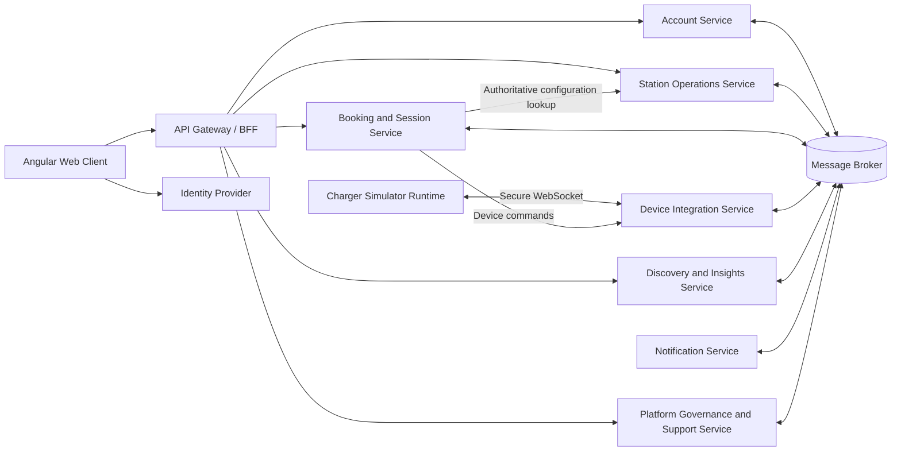

Document ID: ARC-001  
Title: Domain Capability Map and Microservice Boundary Analysis  
Version: 1.0  
Status: IN_REVIEW  
Owner: DA/BA  
Last reviewed: 2026-07-12  
Depends on: GOV-001, GOV-003, REQ-001, DOM-001, DOM-002, PLT-001  
Authoritative for: Proposed microservice boundaries and capability ownership  

# Domain Capability Map and Microservice Boundary Analysis v1.0

## 1. Purpose

This document:

- Maps the approved domain capabilities.
- Identifies consistency, security, scaling and ownership boundaries.
- Evaluates alternative microservice decompositions.
- Recommends an initial service architecture.
- Assigns authoritative data ownership.
- Identifies coupling risks and extraction paths.
- Maps requirements to proposed services.
- Provides the foundation for communication and consistency design.

This document defines **service boundaries**, not final APIs, events, database schemas or deployment technology.

---

## 2. Architectural objective

The architecture must demonstrate meaningful microservice principles without creating unnecessary operational complexity for an individual project.

The decomposition must preserve:

1. Authoritative EVSE allocation.
2. Transactional prevention of double booking.
3. Atomic booking rescheduling.
4. Consistent Booking and Charging Session outcomes.
5. Independent device communication and failure handling.
6. Organization and resource isolation.
7. Failure isolation for search, analytics and notifications.
8. Independent data ownership.
9. No direct cross-service database access.
10. Practical local and low-cost cloud deployment.

---

## 3. Boundary-design criteria

Each proposed boundary is evaluated against:

| Criterion | Meaning |
|---|---|
| Business cohesion | Capabilities change for the same business reasons |
| Transactional affinity | Operations require one atomic transaction |
| Data ownership | The capability requires authoritative control of its records |
| Security boundary | Data or operations require distinct trust controls |
| Scaling profile | Workload differs materially from related capabilities |
| Failure isolation | Failure should not disable unrelated platform functions |
| Change cadence | Functionality may evolve independently |
| Integration complexity | Separation introduces communication and consistency cost |
| Project feasibility | Boundary remains manageable for one developer |

A microservice must have a clear business or operational reason to exist. One entity does not automatically justify one service.

---

# 4. Domain capability map

## 4.1 Identity and account management

### Identity security

- Registration credentials
- Authentication
- Email verification
- Password recovery
- MFA
- Login sessions
- Token issuance and revocation

### Application account

- Profile
- Language and timezone preference
- Notification preferences
- Saved vehicles
- Connector compatibility
- Application account state
- Privacy-request intake
- Account-deletion coordination

Identity credentials and application profile data remain separate.

---

## 4.2 Operator and charging infrastructure

### Organization management

- Operator application
- Approval-dependent activation
- Organization lifecycle
- Staff invitations
- Organization memberships
- Role assignment
- Ownership transfer

### Station catalogue

- Station configuration
- EVSE configuration
- Connector configuration
- Opening hours
- Access instructions
- Amenities
- Publication lifecycle

### Commercial configuration

- Tariff versions
- Tax components
- Booking policies
- Policy inheritance
- Effective configuration lookup

### Operational management

- Maintenance
- Fault incidents
- Driver fault reports
- Status overrides
- Booking-impact assessment
- Operational reassignment requests
- Simulator assignment

---

## 4.3 Booking and charging fulfilment

### Availability authority

- Candidate validation
- Allocation-interval calculation
- Allocation conflict detection
- Capacity blocks
- Automatic EVSE assignment

### Booking management

- Holds
- Confirmation
- Cancellation
- Expiration
- No-show processing
- Rescheduling
- Reassignment
- Tariff and policy snapshots
- Booking history

### Arrival authorization

- Check-in
- EVSE verification
- Start authorization
- Authorization consumption and revocation

### Charging fulfilment

- Charging Session lifecycle
- Start and stop requests
- Accepted device evidence
- Meter sequence processing
- Session reconciliation
- Final session summary
- Estimated cost
- Turnaround release

---

## 4.4 Device integration and simulation

### Machine identity

- Enrollment
- Credential rotation
- Suspension and revocation
- Station/EVSE assignment validation

### Device connectivity

- WebSocket connections
- Boot registration
- Heartbeats
- Connection freshness
- Device-reported state
- Offline queues

### Commands and events

- Command dispatch
- Command-result lifecycle
- Event validation
- Deduplication
- Sequence checking
- State reconciliation

### Simulator control

- Scenario configuration
- Fault injection
- Deterministic simulation seeds
- Disconnect/reconnect behaviour
- Synthetic meter generation

---

## 4.5 Discovery and insights

### Public discovery

- Map and list search
- Geographic queries
- Station details
- Filtering
- Advisory availability
- Operational freshness

### Operator insights

- Utilization
- Energy
- Session statistics
- Cancellation/no-show/failure rates
- Aggregated report exports

### Platform insights

- Platform-wide operational metrics
- Simulator connectivity views
- Workflow backlog
- Reliability projections

All data in this capability is non-authoritative.

---

## 4.6 Communications

- Notification-rule evaluation
- Template rendering
- Email dispatch
- Retry and suppression
- Bounce and complaint processing
- Delivery history
- Reminder scheduling
- Localization

---

## 4.7 Platform governance and support

### Platform governance

- Operator-application review
- User and organization suspension requests
- Station moderation
- Emergency intervention workflows
- Administrative investigations

### Support

- Support cases
- Case assignment
- Temporary scoped access
- Masked data views
- Operational escalation

### Audit projection

- Centralized audit search
- Privileged-action review
- Break-glass review
- Cross-service correlation

Authoritative audit evidence remains local to the service performing the action. The centralized audit view is a projection.

---

# 5. Critical consistency boundaries

## 5.1 Booking allocation

The following must remain within one transactional authority:

- Booking hold
- EVSE allocation
- Conflict detection
- Booking lifecycle transition
- Idempotency result
- Booking audit evidence
- Outbox record

Splitting Allocation from Booking would introduce a distributed transaction into the most important correctness invariant.

**Conclusion:** Booking and Allocation remain in one service.

---

## 5.2 Booking and Charging Session

Charging start requires coordinated changes to:

- Start Authorization
- Charging Session
- Booking state
- EVSE occupation
- Turnaround release calculation

Splitting Booking and Charging Session would create difficult races between:

- `CHECKED_IN → ACTIVE`
- `STARTING → CHARGING`
- Cancellation and session start
- No-show and session start
- Session completion and capacity release
- Fulfilment failure classification

The approved load of 100 charger events per second does not justify accepting this distributed-consistency cost in v1.

**Conclusion:** Booking and Charging Session remain together initially.

An extraction seam must still exist between internal Booking and Charging modules.

---

## 5.3 Infrastructure and maintenance

Station, EVSE, Connector, Tariff, Booking Policy, Maintenance, Fault Incident and Status Override share:

- Operator ownership
- Technician authorization
- Infrastructure lifecycle
- Operational impact analysis
- Configuration versioning

**Conclusion:** Keep them in one Station Operations service.

The Booking authority owns capacity blocks generated from maintenance; the Station Operations service owns the maintenance business record.

---

## 5.4 Device integration

Device communication has a different:

- Trust model
- Protocol
- Connection lifecycle
- Workload
- Scaling pattern
- Failure model
- Security exposure

**Conclusion:** Device Integration is a separate service.

---

## 5.5 Search and analytics

Search and analytics:

- Are eventually consistent.
- Must not become transactional authorities.
- Require projection rebuilds.
- Have read-heavy scaling.
- May fail without disabling booking management.

Their read models can initially share one deployable while remaining separate internal modules.

**Conclusion:** Use one Discovery and Insights service in v1, with an extraction path if analytics grows independently.

---

# 6. Decomposition alternatives

## 6.1 Option A — Lean decomposition

### Services

1. Account and Governance
2. Station and Device Operations
3. Booking and Charging
4. Discovery and Analytics
5. Notification

### Advantages

- Low deployment cost
- Fewer repositories and pipelines
- Simpler local development
- Lower messaging complexity

### Problems

- Device protocol and station configuration share an unsafe trust boundary.
- Account, privacy, administration and support become an incoherent service.
- Failure isolation is weak.
- Station/device scaling profiles are mixed.
- Security responsibilities become broad.

### Assessment

Suitable for a small commercial MVP, but insufficiently expressive for this project’s architectural evaluation.

**Decision:** Not selected.

---

## 6.2 Option B — Balanced decomposition

### Business services

1. Account Service
2. Station Operations Service
3. Booking and Session Service
4. Device Integration Service
5. Discovery and Insights Service
6. Notification Service
7. Platform Governance and Support Service

### Platform components

- API Gateway/BFF
- Identity Provider
- Message Broker
- Relational databases
- Angular web client
- Charger Simulator runtime

### Advantages

- Protects the allocation consistency boundary.
- Isolates device protocol risk.
- Separates public read workloads from transactional workloads.
- Isolates email-provider failure.
- Keeps organization-owned infrastructure cohesive.
- Provides meaningful microservice trade-offs.
- Remains feasible for an individual project.

### Disadvantages

- Seven business services still create substantial operational work.
- Booking depends on station/device information.
- Privacy deletion crosses several services.
- Governance workflows require orchestration.
- Discovery and analytics remain somewhat broad.

**Decision:** Recommended.

---

## 6.3 Option C — Fine-grained decomposition

Potential services:

- Profile
- Organization
- Station Catalogue
- Tariff
- Maintenance
- Fault
- Availability
- Booking
- Charging Session
- Metering
- Device Integration Service
- Simulator Control
- Discovery
- Analytics
- Notification
- Privacy
- Support
- Audit

### Advantages

- Maximum independent deployment
- Highly explicit ownership
- Fine-grained scaling
- Strong portfolio demonstration of decomposition

### Problems

- Excessive distributed consistency
- Booking would require many synchronous dependencies.
- Local development becomes expensive and fragile.
- More migrations, pipelines and observability components.
- Large accidental complexity for one developer.
- Many services would have insufficient independent business value.

**Decision:** Rejected for v1.

---

# 7. Recommended service topology



The diagram shows logical relationships. The final protocol for each relationship is defined in the communication matrix.

---

# 8. Service responsibilities

## 8.1 Account Service

### Owns

- Application account record
- Driver profile
- Saved vehicles
- Connector and power preferences
- Language/timezone preferences
- Notification preferences
- Application account state
- Privacy-request intake
- Privacy export/deletion coordinator
- Privacy tombstones

### Does not own

- Passwords
- MFA factors
- Identity-provider sessions
- Bookings
- Organization memberships
- Support cases
- Notification delivery

### Primary requirements

- FR-IAM-01
- FR-IAM-04
- FR-IAM-05, where application integration is needed
- FR-NOT-02
- FR-PRV-01 through FR-PRV-04

### Boundary rationale

Profile and privacy-account lifecycle change together and contain personal data. They require stronger privacy controls than public infrastructure data.

### Dependencies

- Identity Provider for credential/session actions
- Booking and Session Service for active-obligation checks
- Other services as privacy-workflow participants
- Notification Service for privacy/account messages

---

## 8.2 Station Operations Service

### Owns

- Operator applications
- Operator organizations
- Organization memberships and operator roles
- Staff invitations
- Ownership transfers
- Stations
- EVSE configuration
- Connectors
- Opening hours
- Access information
- Tariff versions
- Booking policy versions
- Maintenance records
- Fault Reports
- Fault Incidents
- Status Overrides
- Simulator-to-station assignment
- Infrastructure audit evidence

### Does not own

- Device credentials
- Device connections
- Device-reported state
- Bookings or allocations
- Charging Sessions
- Public search projections

### Primary requirements

- FR-OPS-01 through FR-OPS-04
- FR-FLT-01
- Infrastructure portions of FR-ADM-01
- FR-AVL-01 inputs

### Boundary rationale

These capabilities share organization tenancy, operator permissions and infrastructure lifecycle.

### Important rule

Maintenance is authoritative here, but an EVSE capacity block used for transactional booking conflict detection is owned by the Booking and Session Service.

---

## 8.3 Booking and Session Service

### Owns

- Booking
- Booking Hold
- EVSE Allocation
- Capacity Block
- Booking state
- Tariff Snapshot
- Policy Snapshot
- Check-In
- Start Authorization
- Charging Session
- Meter sequence and accepted values
- Estimated cost
- Session summary
- No-show and hold-expiry jobs
- Booking/session reconciliation state
- Booking and session history
- Booking/session audit evidence

### Does not own

- Station master data
- Tariff definitions
- Device credentials
- WebSocket connections
- Public discovery projections
- Email delivery

### Primary requirements

- FR-AVL-03
- FR-BKG-01 through FR-BKG-07
- FR-CHG-01 through FR-CHG-04
- FR-HIS-01
- Booking-related FR-PLT requirements

### Boundary rationale

This is the principal strong-consistency boundary. It owns every record needed to prevent double booking and correctly connect planned access to actual usage.

### Internal modules

- Availability Authority
- Allocation
- Booking
- Check-In and Authorization
- Charging Session
- Metering and Cost
- Reconciliation
- History Queries

Internal modules must not become separate services in v1.

---

## 8.4 Device Integration Service

### Owns

- Machine Identity
- Enrollment state
- Credential references
- Connection state
- Boot and heartbeat records
- Device-reported EVSE state
- Device command lifecycle
- Device event inbox
- Station and session sequence tracking
- Offline replay state
- Device reconciliation evidence
- Simulator scenario configuration
- Device-protocol audit evidence

### Does not own

- Infrastructure configuration
- Booking allocation
- Start Authorization
- Charging Session business outcome
- Tariffs or cost

### Primary requirements

- FR-SIM-01 through FR-SIM-04
- Device portions of FR-CHG-02 and FR-CHG-04
- FR-AVL-02
- Device-related FR-PLT requirements

### Boundary rationale

The service forms the untrusted-device boundary and has a unique bidirectional protocol and scaling profile.

### Security boundary

- Machine authentication
- EVSE assignment validation
- Protocol schema validation
- Message and connection limits
- No driver credentials or personal profile data

---

## 8.5 Discovery and Insights Service

### Owns

Only non-authoritative projections:

- Public station search index
- Geographic station projection
- Connector/power summaries
- Advisory availability projection
- Operational freshness projection
- Operator analytics
- Platform analytics
- Aggregated report data
- Projection versions and rebuild state

### Does not own

- Station master records
- Allocation
- Booking decisions
- Device state authority
- User history authority

### Primary requirements

- FR-DIS-01 through FR-DIS-03
- FR-AVL-01 and FR-AVL-02 advisory views
- FR-OPS-05
- FR-ADM-03
- FR-PLT-06

### Boundary rationale

Search and analytics are read-heavy, eventually consistent and independently rebuildable.

### Internal modules

- Public Discovery
- Advisory Availability
- Operator Insights
- Platform Insights
- Projection Rebuild

A future split between Discovery and Analytics is permitted.

---

## 8.6 Notification Service

### Owns

- Notification record
- Delivery attempt
- Template version
- Reminder schedule
- Provider message reference
- Bounce and complaint state
- Suppression state
- Notification deduplication

### Does not own

- Email verification/reset tokens
- Booking state
- Account state
- Recipient profile authority
- Business decision rules outside notification policy

### Primary requirements

- FR-NOT-01 through FR-NOT-03
- Notification portions of FR-PLT-01 through FR-PLT-03

### Boundary rationale

Email-provider outages, retries and template concerns must not block core booking operations.

---

## 8.7 Platform Governance and Support Service

### Owns

- Support Cases
- Case assignments
- Temporary support-access grants
- Administrative investigations
- Emergency intervention workflow records
- Break-glass workflow records
- Governance decision metadata
- Cross-service audit projection
- Privileged-action review state

### Does not own

- User accounts
- Operator organizations
- Stations
- Bookings
- Sessions
- Fault Incidents
- Authoritative business audit facts

### Primary requirements

- FR-ADM-01 and FR-ADM-02 coordination
- FR-SUP-01 and FR-SUP-02
- FR-AUD-02
- Centralized audit-query aspects of FR-AUD-01

### Boundary rationale

Support and governance share case-based, temporary and highly audited access. They must request state changes through authoritative services.

### Important rule

This service never updates another service’s business tables. Emergency intervention is executed through authenticated commands to the authoritative owner.

---

# 9. External and platform components

## 9.1 Identity Provider

Provisional technology: Keycloak.

Owns:

- Credentials
- Email verification
- Password recovery
- MFA
- Identity sessions
- OAuth/OIDC tokens
- Identity-provider account enablement

It is not counted as a custom business microservice.

---

## 9.2 API Gateway/BFF

Responsibilities:

- Public routing
- TLS termination where appropriate
- Token validation
- Correlation IDs
- Coarse rate limiting
- Response composition where justified

It must not:

- Own business data
- Make final authorization decisions
- Allocate EVSE capacity
- implement business workflows

---

## 9.3 Charger Simulator Runtime

A separate deployable representing the external device environment.

It:

- Simulates one or more charging-station controllers.
- Connects only to the Device Integration Service.
- Maintains offline queues.
- Executes deterministic scenarios.
- Cannot directly access platform databases or driver APIs.

---

## 9.4 Message Broker

Used for:

- Integration events
- Notification propagation
- Projection updates
- Workflow coordination
- Device-event forwarding where appropriate

Every producer uses a transactional outbox. Consumers are idempotent.

---

# 10. Authoritative data ownership matrix

| Data | Authoritative owner |
|---|---|
| Credentials, MFA and identity sessions | Identity Provider |
| Application account and profile | Account Service |
| Saved vehicles and compatibility | Account Service |
| Notification preferences | Account Service |
| Privacy-request workflow | Account Service |
| Operator application | Station Operations Service |
| Operator organization and membership | Station Operations Service |
| Station, EVSE and Connector configuration | Station Operations Service |
| Tariff and Booking Policy definitions | Station Operations Service |
| Maintenance and Fault Incident | Station Operations Service |
| Status Override | Station Operations Service |
| Simulator assignment | Station Operations Service |
| Machine Identity and credential reference | Device Integration Service |
| Device connection and heartbeat | Device Integration Service |
| Device-reported state | Device Integration Service |
| Device command lifecycle | Device Integration Service |
| Booking and Hold | Booking and Session Service |
| EVSE Allocation | Booking and Session Service |
| Maintenance-derived capacity block | Booking and Session Service |
| Check-In and Start Authorization | Booking and Session Service |
| Charging Session and accepted Meter Values | Booking and Session Service |
| Tariff/Policy Snapshot | Booking and Session Service |
| Session Summary and Estimated Cost | Booking and Session Service |
| Public search projection | Discovery and Insights Service |
| Analytics projection | Discovery and Insights Service |
| Notification delivery | Notification Service |
| Support Case and temporary case access | Platform Governance and Support Service |
| Local business audit evidence | Service performing the action |
| Cross-service audit search projection | Platform Governance and Support Service |

---

# 11. Requirement-to-service mapping

| Requirement group | Primary owner | Supporting services |
|---|---|---|
| FR-IAM | Account Service / Identity Provider | All services enforce authorization |
| FR-DIS | Discovery and Insights | Station Operations, Device Integration, Booking and Session |
| FR-AVL advisory | Discovery and Insights | Station Operations, Device Integration, Booking and Session |
| FR-AVL authoritative | Booking and Session | Station Operations, Device Integration |
| FR-BKG | Booking and Session | Account, Station Operations, Notification |
| FR-CHG | Booking and Session | Device Integration, Notification |
| FR-HIS | Booking and Session | None required for authority |
| FR-FLT | Station Operations | Platform Governance and Support |
| FR-OPS | Station Operations | Booking and Session, Device Integration, Discovery and Insights |
| FR-ADM | Platform Governance and Support | Every authoritative owner |
| FR-SUP | Platform Governance and Support | Every authoritative owner |
| FR-SIM | Device Integration | Charger Simulator Runtime |
| FR-PLT | Every service | Message Broker and platform infrastructure |
| FR-NOT | Notification | Account and Identity Provider |
| FR-PRV | Account coordinator | Every personal-data owner |
| FR-AUD | Local owner plus Governance audit projection | Every service |

---

# 12. Initial service dependency analysis

## 12.1 Booking creation

The Booking and Session Service requires:

- Active account evidence
- Station publication and administrative eligibility
- EVSE and connector configuration
- Applicable tariff and policy version
- Maintenance/fault/capacity-block information
- Operational confidence where near-term rules require it

The authoritative allocation transaction remains local to Booking and Session.

The next architecture step must decide which inputs are:

- Synchronous authoritative queries
- Versioned local replicas
- Conservatively cached values
- Explicit capacity blocks

---

## 12.2 Charging start

1. Booking and Session consumes the Start Authorization.
2. It records Session `STARTING`.
3. It requests a device command.
4. Device Integration dispatches the command.
5. Device Integration reports command result and transaction evidence.
6. Booking and Session applies accepted evidence.
7. Only transaction-start evidence changes the Session to `CHARGING`.

No distributed transaction is attempted between the two services.

---

## 12.3 Maintenance scheduling

1. Station Operations creates a proposed maintenance workflow.
2. Booking and Session evaluates affected allocations.
3. Reassignment or cancellation resolves conflicts.
4. Booking and Session installs the capacity block.
5. Station Operations marks Maintenance `SCHEDULED`.
6. Activation occurs only after required booking-side confirmation.

This requires an explicit coordinated workflow.

---

## 12.4 Account deletion

Account Service coordinates deletion participants:

- Identity Provider
- Booking and Session
- Station Operations
- Notification
- Platform Governance and Support
- Discovery and Insights

Each participant processes the same workflow ID idempotently.

---

# 13. Security and tenancy boundaries

| Service | Principal security scope |
|---|---|
| Account | User ownership and personal-data protection |
| Station Operations | Operator organization and resource ownership |
| Booking and Session | Driver ownership, operator station scope and allocation correctness |
| Device Integration | Machine identity and assigned infrastructure |
| Discovery and Insights | Public field allowlist and scoped analytics |
| Notification | Recipient minimization and provider-secret protection |
| Governance and Support | Case scope, temporary grants and break-glass review |

Global platform roles must not replace resource-level authorization.

Organization membership is authoritative in Station Operations, not solely in token claims. The final authorization design must determine safe token claims, local replicas and freshness handling.

---

# 14. Scaling and failure isolation

| Component | Scaling driver | Failure effect |
|---|---|---|
| Account | User/profile traffic | Profile and privacy functions degraded |
| Station Operations | Operator configuration traffic | New configuration and some new bookings may degrade |
| Booking and Session | Booking contention and meter events | Core booking/session operations affected |
| Device Integration | Connections and charger events | Starts/status updates affected; existing bookings retained |
| Discovery and Insights | Map/search/read traffic | Discovery unavailable; booking management remains usable |
| Notification | Email queue/provider latency | Email delayed; business commits remain valid |
| Governance and Support | Case/admin traffic | Support/admin workflows delayed; driver core continues |

Booking and Session must support horizontal scale without violating allocation correctness.

Device Integration scales primarily by active WebSocket connection and event volume.

Discovery and Insights may use separate read replicas or indexes later without affecting transactional services.

---

# 15. Database ownership strategy

Each service must have:

- Its own logical database boundary.
- Its own database credentials.
- Its own migrations.
- No cross-service foreign keys.
- No cross-service joins.
- Its own outbox and inbox where required.

For cost efficiency, several logical databases may initially use one physical PostgreSQL cluster.

Sharing a physical cluster does not permit:

- Cross-schema writes
- Cross-service SQL queries
- Shared migration ownership
- Database-level coupling between services

The physical database topology remains an open deployment decision.

---

# 16. Prohibited coupling

The following are prohibited:

1. Device Integration updating Booking tables.
2. Station Operations inserting allocations.
3. Governance directly cancelling bookings in the database.
4. Discovery becoming authoritative for availability.
5. Notification reading another service’s database.
6. Shared domain entities through a common persistence library.
7. Cross-service ORM relationships.
8. Synchronous calls inside an already open database transaction where failure would leave ambiguous local state.
9. Broker events containing passwords, tokens or Start Authorization secrets.
10. A shared “common” module containing business rules owned by multiple services.

Permitted shared libraries are limited to stable technical concerns such as:

- Correlation identifiers
- Event-envelope parsing
- Secure logging utilities
- Test utilities
- General error representation

---

# 17. Extraction paths

## 17.1 Booking and Charging split

A future split is allowed if:

- Meter volume grows independently.
- Charging needs separate deployment scaling.
- A reliable cross-service Booking/Session state protocol is defined.
- Session-start and completion invariants can be preserved.
- Capacity release remains correct during outages.

Until those conditions exist, splitting is rejected.

---

## 17.2 Discovery and Analytics split

This is the lowest-risk future extraction because both sides are projections.

Potential future services:

- Discovery Service
- Analytics Service

No authoritative business state would move.

---

## 17.3 Station Operations split

Potential later boundaries:

- Organization Service
- Station Catalogue Service
- Operations Service

This should occur only if independent organizational complexity or maintenance traffic justifies it.

---

## 17.4 Privacy coordinator split

Privacy workflows may later move from Account into a dedicated Privacy Service if:

- Workflow volume grows.
- Independent compliance ownership is required.
- More external participants are added.

---

# 18. Modular-monolith mapping

The documented modular-monolith alternative should use the same boundaries as internal modules:

```text
platform-monolith
├── account
├── stationoperations
├── booking
├── charging
├── deviceintegration
├── discovery
├── insights
├── notification
├── governance
└── support
```

Important difference:

- Booking and Charging may remain separate modules inside one deployable while sharing a transaction where explicitly approved.
- Modules must not access another module’s tables directly.
- Module APIs and domain events should mirror microservice contracts.
- The monolith may use one PostgreSQL instance with schema/module ownership.
- Device Integration may still remain a separate process because of its external protocol boundary.

This allows meaningful comparison without designing two unrelated systems.

---

# 19. Recommended initial deployables

## Custom platform deployables

1. `account-service`
2. `station-operations-service`
3. `booking-session-service`
4. `device-integration-service`
5. `discovery-insights-service`
6. `notification-service`
7. `platform-governance-service`
8. `api-gateway`
9. `web-client`
10. `charger-simulator`

## Supporting runtime components

- Identity Provider
- RabbitMQ, provisionally
- PostgreSQL
- Email provider
- Map/tile provider
- Observability stack

Service names remain provisional until ADR approval, but their boundaries are recommended.

---

# 20. Boundary decisions

## Proposed for approval

| ID | Decision |
|---|---|
| ARC-BND-01 | Adopt the balanced seven-business-service decomposition. |
| ARC-BND-02 | Keep Booking and Allocation in one service. |
| ARC-BND-03 | Keep Booking and Charging Session in one service for v1. |
| ARC-BND-04 | Keep Organization, Infrastructure, Tariff, Maintenance and Fault capabilities in Station Operations. |
| ARC-BND-05 | Separate Device Integration because of protocol, trust and scaling differences. |
| ARC-BND-06 | Combine public Discovery and Analytics projections initially. |
| ARC-BND-07 | Separate Notification delivery from core transactions. |
| ARC-BND-08 | Use a separate Platform Governance and Support service for case-scoped privileged workflows. |
| ARC-BND-09 | Keep application Account data separate from the Identity Provider. |
| ARC-BND-10 | Place privacy coordination initially in Account Service. |
| ARC-BND-11 | Store authoritative audit evidence locally and build a centralized audit projection. |
| ARC-BND-12 | Use database-per-service logical ownership, even when sharing a physical PostgreSQL cluster. |
| ARC-BND-13 | Treat API Gateway, Identity Provider and Message Broker as platform components rather than business services. |
| ARC-BND-14 | Treat Charger Simulator as an external-device runtime, not an internal platform service. |
| ARC-BND-15 | Preserve extraction seams through internal modules and versioned contracts. |

---

# 21. Open architecture questions

| ID | Question | Required by |
|---|---|---|
| ARC-OQ-01 | Which booking inputs require synchronous authoritative validation? | Communication matrix |
| ARC-OQ-02 | How is account-active status propagated to Booking and Session? | Communication matrix |
| ARC-OQ-03 | How are organization memberships represented in tokens and local authorization data? | Security architecture |
| ARC-OQ-04 | How are maintenance capacity blocks coordinated transactionally? | Communication/event design |
| ARC-OQ-05 | How is tariff/policy version retrieval protected from concurrent changes? | REST/data design |
| ARC-OQ-06 | Does Device Integration publish normalized events through RabbitMQ or call Booking and Session synchronously for selected outcomes? | Communication matrix |
| ARC-OQ-07 | What data may Platform Support retrieve synchronously for an assigned case? | Security/API design |
| ARC-OQ-08 | Should Discovery and Insights use PostgreSQL/PostGIS only or an additional search index? | Technology selection |
| ARC-OQ-09 | How are centralized audit projections protected from tampering? | Security architecture |
| ARC-OQ-10 | Which services must remain available for cancellation when Station Operations is unavailable? | Resilience design |
| ARC-OQ-11 | Will all services be kept in one monorepo? | Repository design |
| ARC-OQ-12 | Will separate service databases share one physical PostgreSQL deployment? | Cloud/data design |

---

# 22. Required ADRs

1. ADR-001 — Balanced microservice decomposition
2. ADR-002 — Booking and Charging Session co-location
3. ADR-003 — Station Operations aggregate boundary
4. ADR-004 — Device Integration boundary
5. ADR-005 — Discovery and Analytics shared deployable
6. ADR-006 — Account versus Identity Provider ownership
7. ADR-007 — Local audit authority and centralized audit projection
8. ADR-008 — Logical database-per-service model
9. ADR-009 — Privacy coordinator placement
10. ADR-010 — API Gateway versus BFF responsibilities

---

# 23. Acceptance criteria

This boundary analysis is approved when:

1. Every authoritative domain entity has exactly one owner.
2. Allocation and double-booking prevention remain within one transactional boundary.
3. No proposed operation requires a cross-service database transaction.
4. Device protocol handling is isolated from driver-facing business services.
5. Search and analytics remain non-authoritative.
6. Notification failure is isolated.
7. Organization tenancy has an authoritative owner.
8. Support cannot directly modify another service’s data.
9. Privacy workflows have an identified coordinator and participants.
10. Every functional requirement group maps to a proposed service.
11. Every service has explicit responsibilities and exclusions.
12. Data ownership does not depend on cross-service foreign keys.
13. The decomposition remains feasible for one developer.
14. Extraction paths are documented.
15. The modular-monolith alternative maps the same domain boundaries.

---

# 24. Recommendation

Adopt **Option B — Balanced decomposition** with seven custom business services.

The most important design choice is the combined **Booking and Session Service**. This reduces distributed-consistency risk around allocation, check-in, charging start, meter processing, session completion and EVSE release.

The service is intentionally larger than the other services because its responsibilities form one end-to-end fulfilment and consistency boundary—not because the architecture is organized by technical layers.

Implementation remains prohibited until communication, contracts, data, security, testing and deployment planning are complete.

---

# 25. Next architecture artifact

The next document is:

**Inter-Service Communication and Consistency Matrix v1.0**

It must define:

- Caller and recipient
- Business purpose
- Synchronous versus asynchronous communication
- Command versus event semantics
- Source of truth
- Expected consistency
- Timeout and retry policy
- Idempotency
- Failure behaviour
- Circuit breaking
- Reconciliation
- Data sensitivity
- Availability dependency
